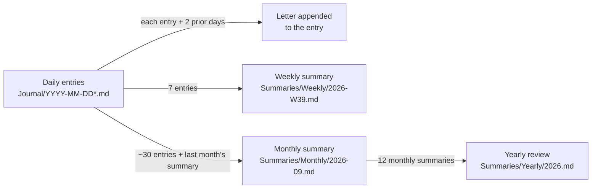

# Journal Companion

An Obsidian plugin that reads your daily journal and writes back.

- **Daily letters.** When you finish an entry, a short and specific note of encouragement is appended to it as a callout. It responds to what you actually wrote, not generic praise.
- **Weekly, monthly, and yearly summaries.** When each period ends, the plugin writes a summary: your emotional arc, what you got done, recurring themes, patterns worth noticing, and small suggestions for the next period.
- **Catch-up.** If your laptop was closed for a few days, anything missed is filled in the next time Obsidian opens.

It runs on the [Claude API](https://docs.claude.com) and replies in whatever language you journal in. Chinese, English, and mixed entries all work.

```markdown
> [!ai-reply] 💌 A letter from Claude · 2026-09-25 08:12
> You went on that run even though you said you almost talked yourself out
> of it. That's the part worth noticing, more than the distance. ...
```

## How it works



### Design decisions

**Hierarchical summarization.** The yearly review reads the 12 monthly summaries instead of 365 raw entries. This keeps each request small and cheap, and it also tends to produce a better result, because the model works from material that has already been distilled rather than a year of day-to-day noise. Monthly summaries read the raw entries, since a month still fits comfortably in context. They also get the previous month's summary so they can describe what changed.

**Idempotent catch-up instead of a scheduler.** Obsidian isn't always running, so cron-style timing would silently miss periods. Instead, `runChecks()` runs when Obsidian starts and every 30 minutes after that. Each run asks what *should* exist and doesn't: past entries with no reply, completed ISO weeks with no weekly file, completed months, completed years. It generates only those. Running it twice does nothing extra, and a week with the laptop closed repairs itself. The order is weeks, then months, then years, because yearly reviews depend on monthly summaries.

**Replies never feed back into the model.** Letters are tagged with a custom callout type (`[!ai-reply]`). Before any entry is sent to the API, `stripReplies()` removes these blocks. This keeps the model from quoting its own earlier letters back to you, and it avoids paying for those tokens again. The logic is pure and unit-tested in `tests/utils.test.ts`.

**Safe writes.** Replies are appended with `vault.process()`, which reads and writes the file atomically, so an edit you're making at the same moment isn't overwritten.

**Right-sized models.** Daily letters are short and frequent, so they use a small, fast model (Claude Haiku). Summaries run a few times a month and need more synthesis, so they use a larger model (Claude Sonnet). Both are configurable.

### Project structure

```
src/
  main.ts       plugin lifecycle, entry discovery, replies, summaries, catch-up loop
  claude.ts     minimal Anthropic Messages API client (uses Obsidian's requestUrl, which isn't subject to CORS)
  prompts.ts    system prompts for letters and each summary level
  settings.ts   settings schema, defaults, and settings tab
  utils.ts      pure helpers: date parsing, callout formatting and stripping
tests/
  utils.test.ts Vitest unit tests for the pure helpers
```

## Installation

This plugin is not in the Obsidian community directory yet, so it has to be installed manually.

1. Build the plugin (see [Development](#development)), or download `main.js` and `manifest.json` from a release.
2. Copy both files to `<your vault>/.obsidian/plugins/journal-companion/`.
3. In Obsidian, open **Settings → Community plugins**, turn off Restricted mode, and enable **Journal Companion**.

### Getting an API key

1. Sign in at [console.anthropic.com](https://console.anthropic.com).
2. Add credit under **Billing**. API usage is billed separately from a Claude.ai subscription, and a few dollars lasts a long time.
3. Open **API Keys → Create Key** and copy the key, which starts with `sk-ant-`. It is shown only once.
4. In Obsidian, go to **Settings → Journal Companion**, paste the key, and click **Test connection**.

## Usage

| Action | How |
|---|---|
| Get a letter right after writing | Click the ❤️ ribbon icon, or run **Reply to the current journal entry** |
| Rewrite a letter | **Regenerate the reply for the current entry** |
| Preview this week's summary mid-week | **Generate or refresh the weekly summary for the current entry's week** |
| Force a catch-up | **Catch up now: missing replies and summaries** |

By default, entries from before today get their letter automatically the next time Obsidian opens. If you'd like today's entry answered once you stop typing, set **Reply to today's entry after N idle minutes** (for example, 30).

Entry filenames must start with `YYYY-MM-DD`. Anything after the date is ignored, so `2026-09-22.md` and `2026-09-22 Tue..md` both work.

## Cost

With default settings, a daily letter costs well under one cent with Claude Haiku, even with two earlier entries included as context. Summaries use the larger model but run only about five times a month. For one daily journal, expect roughly a dollar a month or less. Check current pricing at [anthropic.com/pricing](https://www.anthropic.com/pricing).

## Privacy

- Entry text is sent to the Anthropic API to generate letters and summaries. Nothing is sent anywhere else.
- Your API key is stored in plain text in `.obsidian/plugins/journal-companion/data.json`. If you sync your vault to Git, add that file to `.gitignore`.

## Development

```bash
npm install
npm run dev     # rebuild on change
npm test        # unit tests
npm run build   # type-check and produce main.js
```

To try your changes, symlink or copy the repo into `<vault>/.obsidian/plugins/journal-companion/` and reload Obsidian.

## Roadmap

- Store the API key in the OS keychain instead of `data.json`
- A "memory" note of recurring people and goals, so letters can refer to longer-term context
- Mood tracking across summaries, charted in a dashboard note
- Support for other LLM providers behind the same interface

## License

MIT
